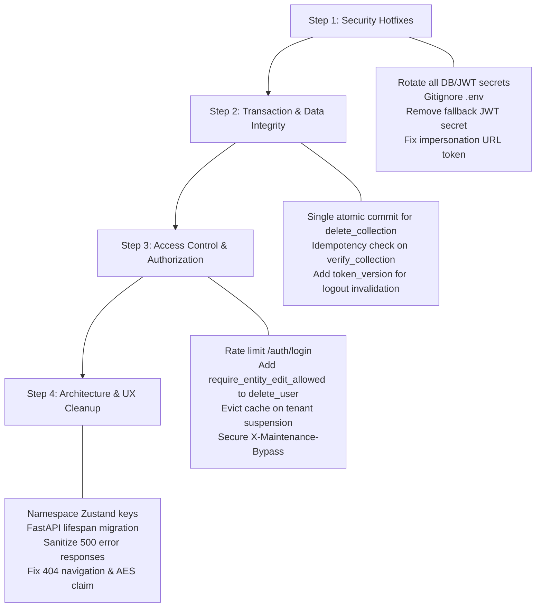

# CrediiFlow — Comprehensive QA Audit Bugs & Vulnerabilities Summary

**Audit Date:** August 30, 2026  
**Auditor Role:** Senior QA Automation Architect / Lead SDET  
**Application:** CrediiFlow Operations Platform v3.0  
**Overall Risk Assessment:** **NOT READY — CRITICAL ISSUES**  
**Total Identified Bugs:** **27** (4 Critical, 8 High, 10 Medium, 5 Low/Trivial)

---

## 1. Executive Summary & Metric Breakdown

### Severity Breakdown
| Severity | Count | Priority | Release Impact |
|---|:---:|:---:|---|
| **Critical** | 4 | P0 | Hard blocker. Severe security breach and balance corruption risks. |
| **High** | 8 | P1 | High security, authorization bypass, and data integrity vulnerabilities. |
| **Medium** | 10 | P2 | Technical debt, race conditions, edge-case crashes, and XSS risks. |
| **Low / Trivial** | 5 | P3 | Codebase hygiene, UX discrepancies, and minor infrastructure items. |

### Module Breakdown
| Category | Count | Bug IDs |
|---|:---:|---|
| **Security & Secrets** | 8 | BUG-E2E-001, BUG-E2E-002, BUG-E2E-003, BUG-E2E-007, BUG-E2E-011, BUG-E2E-012, BUG-E2E-020, BUG-E2E-021 |
| **Authentication & Authorization** | 5 | BUG-E2E-005, BUG-E2E-006, BUG-E2E-009, BUG-E2E-015, BUG-E2E-016 |
| **Data Integrity & Transactions** | 6 | BUG-E2E-004, BUG-E2E-008, BUG-E2E-010, BUG-E2E-014, BUG-E2E-018, BUG-E2E-022 |
| **Validation & Schema** | 3 | BUG-E2E-015, BUG-E2E-016, BUG-E2E-017 |
| **Frontend & UX State** | 4 | BUG-E2E-012, BUG-E2E-019, BUG-E2E-024, BUG-E2E-026 |
| **Architecture & DevOps** | 3 | BUG-E2E-013, BUG-E2E-023, BUG-E2E-027 |

---

## 2. Detailed Bug Reports

---

### Critical Severity (P0 — Immediate Release Blockers)

#### BUG-E2E-001: Hardcoded Production Database Credentials and JWT Secret Committed to Git
- **Module:** Security / Configuration Management
- **Files Affected:** `.env` (root lines 3, 10), `do-it-services/.env` (lines 3, 10), `.gitignore`
- **Technical Cause:** The root-level `.env` file containing plaintext `POSTGRES_PASSWORD=securepassword` and `JWT_SECRET_KEY=supersecretkeyfortesting123` was committed into git. The root `.gitignore` did not exclude root `.env`.
- **Impact & Risk:** Full database and authentication compromise. Anyone with read access to the repository can forge administrative JWT tokens and connect directly to the database.
- **Recommended Fix:**
  1. Immediately rotate PostgreSQL credentials and all JWT signing secrets.
  2. Remove `.env` from Git tracking (`git rm --cached .env`).
  3. Ensure `.env` and `*.env` are in root `.gitignore`.
  4. Provide a sanitized `.env.example` template for configuration.

---

#### BUG-E2E-002: JWT Secret Key Has Weak Default Fallback in Source Code
- **Module:** Security / Authentication
- **Files Affected:** `backend/app/config.py` (line 18)
- **Technical Cause:** `JWT_SECRET_KEY: str = "dev-secret-key-change-in-production"` provides a hardcoded fallback string when the environment variable is missing.
- **Impact & Risk:** Complete authentication bypass in misconfigured or default deployments. Attackers can sign tokens with the known fallback key to gain full superadmin/admin access.
- **Recommended Fix:** Enforce mandatory configuration without fallback; raise a startup error if `JWT_SECRET_KEY` is undefined or matches known development defaults.

---

#### BUG-E2E-003: Impersonation Access Token Leaked via URL Query Parameters
- **Module:** Security / SuperAdmin Impersonation
- **Files Affected:** `frontend/src/app/page.tsx` (lines 41–53), SuperAdmin impersonation router
- **Technical Cause:** SuperAdmin "Impersonate Admin" navigates to `https://<tenant>.crediiflow.in/?impersonate_token=<JWT>&impersonate_id=...`. The full 24-hour admin JWT is passed as a URL query parameter.
- **Impact & Risk:** Complete tenant admin account takeover. Tokens in URLs get stored in browser history, Nginx/CDN access logs, analytics scripts, and `Referer` headers.
- **Recommended Fix:** Replace query-parameter token passing with a short-lived (e.g. 60-second), single-use exchange ticket redeemed via a secure POST request or direct backend-issued HttpOnly session cookies.

---

#### BUG-E2E-004: `delete_collection` Commits Deletion Before Recalculating Balances (Split Transaction Race Condition)
- **Module:** Data Integrity / Collections & Ledger
- **Files Affected:** `backend/app/routers/collections.py` (lines 592–598), `backend/app/routers/retailers.py`
- **Technical Cause:**
  ```python
  db.delete(collection)
  db.commit()  # <-- First commit: deletion visible immediately
  if retailer_id:
      recalculate_balances(retailer_id, db)
      db.commit()  # <-- Second commit: recalculated balances committed separately
  ```
- **Impact & Risk:** Severe financial data inconsistency under concurrent operations. During the gap between commits, other requests read out-of-sync balances. If a crash or timeout occurs after the first commit, balances remain permanently corrupted until manually fixed.
- **Recommended Fix:** Combine the deletion and balance recalculation into a single atomic transaction:
  ```python
  db.delete(collection)
  db.flush()
  if retailer_id:
      recalculate_balances(retailer_id, db)
  db.commit()
  ```

---

### High Severity (P1 — Major Security & Data Integrity Risks)

#### BUG-E2E-005: Refresh Token Not Invalidated on Logout (Stateless Revocation Gap)
- **Module:** Authentication / Session Management
- **Files Affected:** `backend/app/routers/auth.py` (lines 150–154), `backend/app/database/models.py`
- **Technical Cause:** The `/auth/logout` endpoint merely instructs the browser to delete the cookie via `response.delete_cookie("refresh_token")`. There is no server-side token blacklist or `token_version` tracking for tenant users.
- **Impact & Risk:** A captured refresh token remains valid for 7 days. Attackers with stolen cookies can continue generating valid access tokens via `/auth/refresh` even after the user logs out.
- **Recommended Fix:** Add a `token_version` column to the tenant `User` model (mirroring the `SuperAdmin` model). Increment `token_version` on logout or password change, and reject tokens whose embedded version does not match the database.

---

#### BUG-E2E-006: No Rate Limiting on Login Endpoint (Brute-Force Vulnerability)
- **Module:** Authentication / Security
- **Files Affected:** `backend/app/routers/auth.py`, `nginx.conf` (line 33)
- **Technical Cause:** `/auth/login` has no request rate limiting, failed attempt lockout, or CAPTCHA. Nginx rate limiting is applied globally at 15 r/s (too generous for login attempts), and direct access to port 8000 has zero throttling.
- **Impact & Risk:** Credential stuffing and distributed brute-force attacks against user accounts.
- **Recommended Fix:** Implement backend rate limiting on `/auth/login` (e.g. 5 attempts/min per IP/phone using `slowapi` or Redis) and implement progressive backoff / account lockout after multiple consecutive failures.

---

#### BUG-E2E-007: Global Exception Handler Leaks Internal Error Details to Clients
- **Module:** Security / Error Handling
- **Files Affected:** `backend/app/main.py` (lines 292–295)
- **Technical Cause:**
  ```python
  return JSONResponse(
      status_code=500,
      content={"detail": f"Internal server error: {str(exc)}"}
  )
  ```
- **Impact & Risk:** Information disclosure. SQL syntax errors, database schema details, file system paths, and internal variable values are returned directly to API clients.
- **Recommended Fix:** Log the full exception stack trace on the server side and return a sanitized, generic error payload: `{"detail": "An internal server error occurred. Please contact support."}` with a unique correlation/request ID.

---

#### BUG-E2E-008: Tenant Engine Cache Never Evicted on Tenant Suspension
- **Module:** Data Integrity / Multi-Tenancy
- **Files Affected:** `backend/app/database/db.py` (lines 66–84, 116–129), `backend/app/routers/super_admin.py`
- **Technical Cause:** `_tenant_db_names` and `_tenant_engines` cache database connections in memory. On cache HIT, `get_tenant_session` skips the database status check. While `evict_tenant_cache()` exists, it is only invoked on tenant deletion, not suspension.
- **Impact & Risk:** A suspended tenant continues to operate and access the system without interruption until the server process restarts.
- **Recommended Fix:** Call `evict_tenant_cache(subdomain)` immediately upon updating tenant status to `suspended` or `inactive`, and periodically re-verify tenant active status or check status directly on requests.

---

#### BUG-E2E-009: `delete_user` Endpoint Lacks `require_entity_edit_allowed` Gate
- **Module:** Authorization / User Management
- **Files Affected:** `backend/app/routers/users.py` (lines 118–122 vs line 87)
- **Technical Cause:** `update_user` enforces `_edit_gate = Depends(require_entity_edit_allowed)`, but `delete_user` only requires `require_admin`.
- **Impact & Risk:** Privilege escalation / administrative bypass. Tenant admins can delete staff users even when the SuperAdmin has explicitly locked entity edits (`tenant_admin_can_edit_entities = False`).
- **Recommended Fix:** Add `_edit_gate: None = Depends(require_entity_edit_allowed)` to the `delete_user` route parameters.

---

#### BUG-E2E-010: `verify_collection` Creates Duplicate Ledger Entries (No Idempotency Guard)
- **Module:** Data Integrity / Collections & Ledger
- **Files Affected:** `backend/app/routers/collections.py` (lines 441–449)
- **Technical Cause:** `verify_collection` constructs and inserts a new `Ledger` record without verifying whether an existing ledger entry already references the `collection_id`.
- **Impact & Risk:** If collection status was reset to pending or manipulated, verifying it again creates duplicate ledger entries, double-crediting the retailer's balance.
- **Recommended Fix:** Add an idempotency check: check if `db.query(Ledger).filter(Ledger.collection_id == collection.id).first()` exists before creating a new ledger entry, or use a unique database constraint on `Ledger.collection_id`.

---

#### BUG-E2E-011: Unauthenticated Maintenance Mode Bypass Header
- **Module:** Security / Authorization
- **Files Affected:** `backend/app/dependencies.py` (lines 21–22)
- **Technical Cause:**
  ```python
  if request.headers.get("X-Maintenance-Bypass") == "true":
      return
  ```
  This check executes before user authentication is verified.
- **Impact & Risk:** Any user or attacker can bypass platform maintenance mode simply by sending the `X-Maintenance-Bypass: true` header.
- **Recommended Fix:** Require SuperAdmin authentication or a cryptographically secure shared secret before honoring the maintenance bypass header.

---

#### BUG-E2E-012: Login Page Claims "Secure AES-256 Encrypted Session"
- **Module:** Frontend / Compliance
- **Files Affected:** `frontend/src/app/page.tsx` (line 196)
- **Technical Cause:** The login page footer displays `"Secure AES-256 Encrypted Session"`, whereas the application actually uses JWT signed with HS256 over standard TLS transport.
- **Impact & Risk:** Misleading marketing and compliance risk (false security claim).
- **Recommended Fix:** Update the UI text to accurately reflect the security posture, e.g., `"Protected by TLS 1.3 & Secure JWT Authentication"`.

---

### Medium Severity (P2 — Architectural, Validation & Security Hardening)

#### BUG-E2E-013: Deprecated `@app.on_event("startup")` Used in FastAPI
- **Module:** Backend / Lifecycle Management
- **Files Affected:** `backend/app/main.py` (line 38)
- **Technical Cause:** Startup lifecycle handler uses `@app.on_event("startup")`, which is deprecated in modern FastAPI versions (0.100+).
- **Impact & Risk:** Future framework upgrades will break application initialization.
- **Recommended Fix:** Refactor startup/shutdown logic into an `asynccontextmanager` using FastAPI `lifespan`.

---

#### BUG-E2E-014: Deprecated `datetime.utcnow()` and Naive UTC Timestamps
- **Module:** Data Integrity / Timestamps
- **Files Affected:** `backend/app/security.py` (lines 38, 53), `backend/app/database/models.py`, `backend/app/logic/cash_lock.py`
- **Technical Cause:** `datetime.utcnow()` is deprecated in Python 3.12+ and returns timezone-naive datetime objects, which are inconsistently compared with IST timestamps.
- **Impact & Risk:** Deprecation warnings and subtle timestamp comparison bugs across timezone boundaries.
- **Recommended Fix:** Standardize on timezone-aware UTC: `datetime.now(datetime.timezone.utc)` or use dedicated helper functions consistently.

---

#### BUG-E2E-015: `LoginRequest` Schema Lacks Phone Number Validation
- **Module:** Validation / Authentication
- **Files Affected:** `backend/app/schemas/auth.py` (lines 53–55 vs lines 14–22)
- **Technical Cause:** `UserBase` implements strict regex and digit sanitization, but `LoginRequest` defines `phone: str` with no validator.
- **Impact & Risk:** Allows malformed or arbitrary strings to trigger database queries.
- **Recommended Fix:** Apply phone number sanitization and format validation (`10-15 digits`) on `LoginRequest`.

---

#### BUG-E2E-016: Role Validator Accepts Phantom `"partner"` Role
- **Module:** Validation / User Management
- **Files Affected:** `backend/app/schemas/auth.py` (line 29), `backend/app/dependencies.py`
- **Technical Cause:** `validate_role` permits `["admin", "staff", "partner"]`, but no endpoints, permissions, or business logic handle the `"partner"` role.
- **Impact & Risk:** Users created with the `"partner"` role can authenticate but receive 403 Forbidden on all functional routes.
- **Recommended Fix:** Remove `"partner"` from the valid role list or implement explicit role handling and access policies.

---

#### BUG-E2E-017: Inconsistent Amount Validation Between Collections and Deposits
- **Module:** Validation / Business Logic
- **Files Affected:** `backend/app/schemas/collection.py` (line 44), `backend/app/schemas/deposit.py` (line 21)
- **Technical Cause:** Collections permit `total_amount <= 0` (`ge=NUMERIC_12_2_MIN`), allowing zero or negative values, whereas Deposits strictly require `amount > 0` (`gt=0`).
- **Impact & Risk:** Staff can submit ₹0.00 collections, cluttering the ledger with zero-value transactions, or submit negative entries with ambiguous credit semantics.
- **Recommended Fix:** Enforce `gt=0` for standard collections, or define a dedicated adjustment workflow if negative net entries are required.

---

#### BUG-E2E-018: `delete_collection` Two-Commit Pattern Leaves Inconsistent Balance on Crash
- **Module:** Data Integrity / Transaction Boundaries
- **Files Affected:** `backend/app/routers/collections.py` (lines 592, 598)
- **Technical Cause:** Two sequential `db.commit()` calls execute: one for record deletion and one for balance recalculation.
- **Impact & Risk:** Any runtime exception or process termination between the two commits permanently leaves retailer balances out of sync with actual collection records.
- **Recommended Fix:** Flush the deletion within the existing transaction and perform recalculation prior to a single `db.commit()`.

---

#### BUG-E2E-019: Zustand `localStorage` Key `"doit-services-storage"` Hardcoded Across All Tenants
- **Module:** Frontend / Multi-Tenancy
- **Files Affected:** `frontend/src/app/store.ts` (line 167), `frontend/src/app/utils/api.ts` (lines 146–154)
- **Technical Cause:** Zustand persist configuration uses a static string name `"doit-services-storage"`.
- **Impact & Risk:** If a user accesses multiple tenant subdomains in the same browser, cached session, collection, and deposit state can bleed across tenants before the new API response loads.
- **Recommended Fix:** Dynamically namespace the storage key using the current subdomain: `name: \`crediiflow-storage-${window.location.hostname}\``.

---

#### BUG-E2E-020: JWT Access Token Stored in `localStorage`
- **Module:** Security / Frontend State
- **Files Affected:** `frontend/src/app/store.ts` (line 9, 167), `nginx.conf` (line 129)
- **Technical Cause:** Access tokens are saved in `localStorage` via Zustand persist. The CSP header permits `'unsafe-inline'` and `'unsafe-eval'`.
- **Impact & Risk:** Cross-Site Scripting (XSS) vulnerability can allow malicious scripts to read and exfiltrate valid access tokens.
- **Recommended Fix:** Keep access tokens strictly in memory (Zustand state excluded from persist) and use HttpOnly cookies for session refreshes, while tightening the Content Security Policy.

---

#### BUG-E2E-021: No Maximum Password Length on `LoginRequest` (Argon2 DoS Potential)
- **Module:** Security / Authentication
- **Files Affected:** `backend/app/schemas/auth.py` (line 55), `backend/app/security.py` (lines 10–14)
- **Technical Cause:** `LoginRequest.password` has no `max_length`. Argon2 is configured with 64MB memory cost and multiple passes.
- **Impact & Risk:** An attacker sending multiple requests with multi-megabyte password strings can exhaust server CPU and memory resources.
- **Recommended Fix:** Add `max_length=128` constraint to `password` in `LoginRequest` and all related user schemas.

---

#### BUG-E2E-022: `BankDeposit.reference_no` Has Global `unique=True` Constraint
- **Module:** Data Integrity / Deposits
- **Files Affected:** `backend/app/database/models.py` (line 320), `backend/app/routers/deposits.py`
- **Technical Cause:** `BankDeposit.reference_no` has `unique=True`. If two staff submit deposits with matching bank reference numbers, the database throws an unhandled `IntegrityError` resulting in a 500 response.
- **Impact & Risk:** Unhandled 500 errors and false deposit submission rejections.
- **Recommended Fix:** Gracefully handle `IntegrityError` by returning a clean 400 validation message (`"Reference number already registered"`), or scope the uniqueness constraint appropriately.

---

### Low & Trivial Severity (P3 — DevOps Hygiene, Minor UX & Cleanup)

#### BUG-E2E-023: `do-it-services/` Subdirectory Duplicates the Entire Codebase
- **Module:** DevOps / Repository Structure
- **Files Affected:** `do-it-services/` directory
- **Technical Cause:** The entire repository is duplicated inside the `do-it-services/` folder with its own `.git/` and configuration files.
- **Impact & Risk:** Code drift and maintenance confusion; fixes applied to one copy may not propagate to the other.
- **Recommended Fix:** Consolidate into a single source of truth; remove the duplicated directory or track it as an explicit submodule.

---

#### BUG-E2E-024: 404 Page "Go Back" Button Navigates to `"/"`
- **Module:** Frontend / UX Navigation
- **Files Affected:** `frontend/src/app/not-found.tsx` (lines 47–53)
- **Technical Cause:** The "Go Back" button is a static `Link` pointing to `"/"`, behaving identically to the "Return to Dashboard" button.
- **Impact & Risk:** Poor UX navigation flow.
- **Recommended Fix:** Use `router.back()` or `window.history.back()` for the "Go Back" action.

---

#### BUG-E2E-025: Health Check Root Endpoint Depends on Tenant Resolution
- **Module:** API / Infrastructure Monitoring
- **Files Affected:** `backend/app/main.py` (lines 360–377)
- **Technical Cause:** The root `"/"` endpoint uses `Depends(get_db)`, requiring a valid tenant header or subdomain.
- **Impact & Risk:** Generic load balancer or container health checks hitting `"/"` fail with 400 Bad Request if tenant headers are absent.
- **Recommended Fix:** Make `"/"` or `"/health"` a standalone, lightweight endpoint independent of tenant database resolution.

---

#### BUG-E2E-026: "Remember Me" Stores Plaintext Phone Number in `localStorage`
- **Module:** Frontend / Privacy
- **Files Affected:** `frontend/src/app/page.tsx` (line 74)
- **Technical Cause:** Phone number is written directly to `localStorage.setItem("rememberedPhone", phone)`.
- **Impact & Risk:** Minor privacy consideration under data protection guidelines on shared workstations.
- **Recommended Fix:** Document as intended UX behavior or add basic encoding/opt-out controls.

---

#### BUG-E2E-027: Startup Migration Unconditionally Overwrites Edit Window Settings
- **Module:** Backend / Database Migrations
- **Files Affected:** `backend/app/main.py` (lines 63–64)
- **Technical Cause:**
  ```sql
  UPDATE tenants SET edit_window_minutes = 10 WHERE edit_window_minutes = 5;
  UPDATE tenants SET delete_window_minutes = 10 WHERE delete_window_minutes = 5;
  ```
  Runs automatically on every backend startup.
- **Impact & Risk:** SuperAdmin intentionally configuring a 5-minute window will have it reset to 10 minutes upon restart.
- **Recommended Fix:** Move schema and data updates to an Alembic migration script rather than running raw SQL in startup events.

---

## 3. Remediation Action Plan


